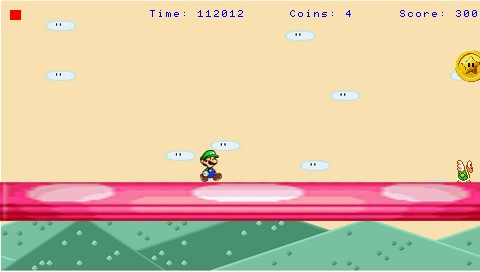

Luigi's World (v2)
===========

An homebrew game written in Lua for PSP 

##What's this ?
A minimalistic platformer game.

##Notes
Compatible with PSP Slim and Fat (Uses *LPHM 5*).

##Installation Path
ms0:/PSP/GAME/

##License
* *Code* : The MIT License (MIT). Copyright (c) 2008 Roland Y. See [LICENSE](license).
* *Sprites* : Copyright (c) 2008 JOY6679.
